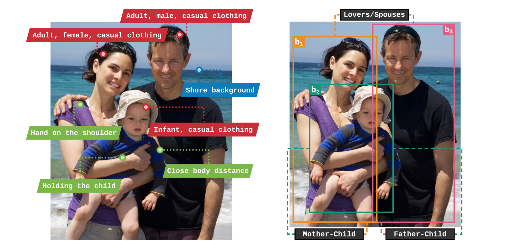
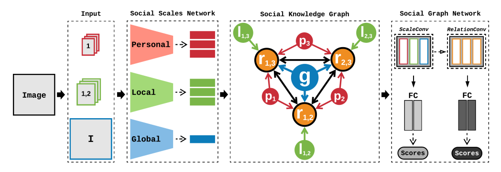

# Structural Reasoning for Image-based Social Relation Recognition

[](https://ubuntu.com/)
[](https://www.python.org/)
[](https://pytorch.org/)

> ⚠️ End-to-end implementation of the **Social Graph Network (SGN)** and all the experiments described in the [**Structural Reasoning for Image-based Social Relation Recognition**](https://authors.elsevier.com/c/1hTvU3qy-3aj0o) paper. If you find the contents of this repository useful in your research, please consider citing us:
> ```BibTeX
> @article{Sousa2023StructuralRF,
>   title = {Structural reasoning for image-based social relation recognition},
>   journal = {Computer Vision and Image Understanding},
>   volume = {235},
>   pages = {103785},
>   year = {2023},
>   issn = {1077-3142},
>   doi = {https://doi.org/10.1016/j.cviu.2023.103785},
>   url = {https://www.sciencedirect.com/science/article/pii/S1077314223001650},
>   author = {Eduardo {V. Sousa} and Douglas {G. Macharet}},
>   keywords = {Social relation recognition, Scene understanding, Group interaction, Image classification}
> }
> ```

## Overview

The image-based relation recognition task consists of identifying the social connections between each pair of individuals in a given picture. In this work, we consider **multiple information scopes** from the input image and **their correlations** to achieve the high-level reasoning required to identify social relations, as illustrated in the following image:



To achieve this, we developed a model that combines **multiple convolutional backbones specializing in each scope**. Their features are used to generate **an unique graph representation** which is employed to perform relation reasoning. This is done by our proposed **deep graph model**, which is composed of **three distinct spatial graph convolution methods** designed to exploit the unique representation. An overview of the framework is shown in the following figure:



## Installation

Create a new environment and activate it, then clone the repository and install the requirements using the following commands:

```Bash
git clone https://github.com/eduardoatr/Structural_Reasoning_SRR.git
cd Structural_Reasoning_SRR
pip install -r requirements.txt
```

## Datasets

Download the benchmark datasets:

- [People in Photo Album (PIPA) dataset](https://people.eecs.berkeley.edu/~nzhang/piper.html)
- [People in Social Context (PISC) dataset](https://zenodo.org/record/1059155)

Additionally, download the [relationship annotations](https://www.mpi-inf.mpg.de/departments/computer-vision-and-machine-learning/research/human-activity-recognition/social-relation-recognition) for the PIPA dataset.

## Pre-trained Models

The pre-trained models employed for attribute features extraction can be obtained from:

- [Individual Age/Gender/Clothing Features](https://www.mpi-inf.mpg.de/departments/computer-vision-and-machine-learning/research/human-activity-recognition/social-relation-recognition)
- [Relative Activity Features](http://imsitu.org/download/)
- [Relative Emotion Features](https://github.com/gxstudy/Graph-Neural-Networks-for-Image-Understanding-Based-on-Multiple-Cues)
- [General Object Features](https://github.com/hujie-frank/SENet)

## Pre-processing

To run the provided model, first, it is necessary to execute some pre-processing steps over the original data, shifting the previous pair-wise paradigm to an image-based approach. The following instructions provide information on how to set up the source data for this process.

### Directories structure

Unpack the downloaded data, generating the following directories structure:

```text
.
└── datasets
    ├── PIPA
    |   ├── annotations
    |   ├── images
    |   |   ├── body
    |   |   ├── face
    |   |   └── full
    |   ├── objects
    |   └── splits
    |       ├── consistency_annotator
    |       └── consistency_relation
    └── PISC
        ├── annotations
        ├── images
        |   └── full
        ├── objects
        └── splits
            ├── domain
            └── relationship
```

Allocate each type of image provided by the original data to their respective folders (**body, face, and full**). The train/test protocols should be assigned to the **splits** folder, and metadata files should stay in the **annotations** folder.

### Processing data

Fill the correct paths and configurations in the **processing_datasets.sh** script, then run it to generate the final metadata files merging the original annotations to consider an image-based approach.

## Feature extraction

To use the given feature generation scripts, organize the downloaded extraction models according to the following structure:

```text
.
└── models
    └── Caffe
        ├── models
        └── protocols
```

Allocate the Caffe protocols and the models to their respective folders, then execute the **extracting_atf.sh** script after filling paths and other configuration information.

## Training and Testing

Fill in the necessary parameters for the models and use the **training.sh** and **testing.sh** scripts to train a model and run it on inference mode.
